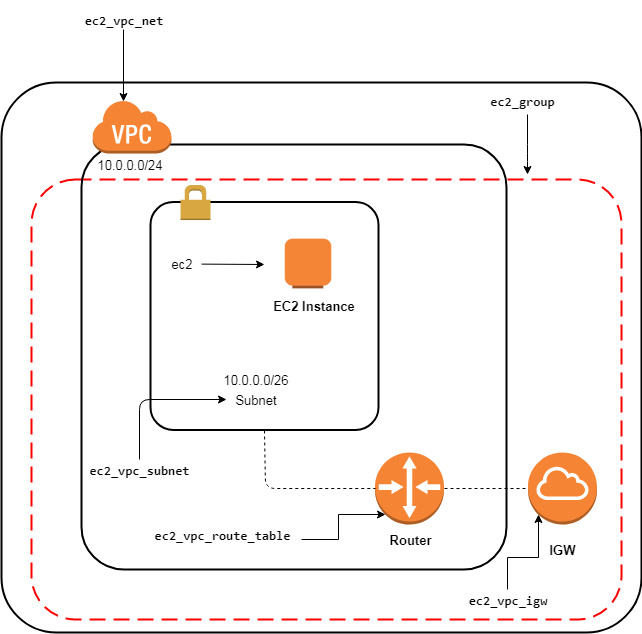

# About
Environments and applications are fully configured by Ansible solution.

Cloud of choice - AWS.

## Architecture

## Prerequisites
#### Credentials:
* AWS account with premade `Access Key ID` and `Secret Access Key`
* Vault pass `123` (literally) to execute playbooks with sensitive data
#### Software:
* ansible 2.5+
* python 3.6+
* python-boto
* python-boto3

Tested on Manjaro Linux 21.2.6 x86_64, kernel 5.17.1-3-MANJARO, ansible 2.13.2, python 3.10.4.

## Installation
1. Edit `credentials` file, place your AWS access keys
2. Execute playbooks using commands below:

    2.1 `ansible-playbook 1-create-vpc.yml --ask-vault-pass`

    2.2 `ansible-playbook -i ./hosts 2-install-app.yml --user ubuntu --private-key ./key.pem --ask-vault-pass`

    2.3 `ansible-playbook -i ./hosts 3-start-app.yml --user ubuntu --private-key ./key.pem --ask-vault-pass`

## Verification
Check IP address in generated `hosts` file, enter http://ip:3000

## TODO
* k8s/osp cluster to achieve high availability and fault tolerance
* jenkins, teamcity, etc. to improve automation
